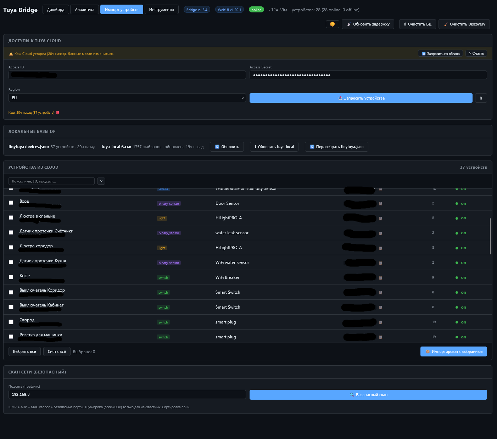
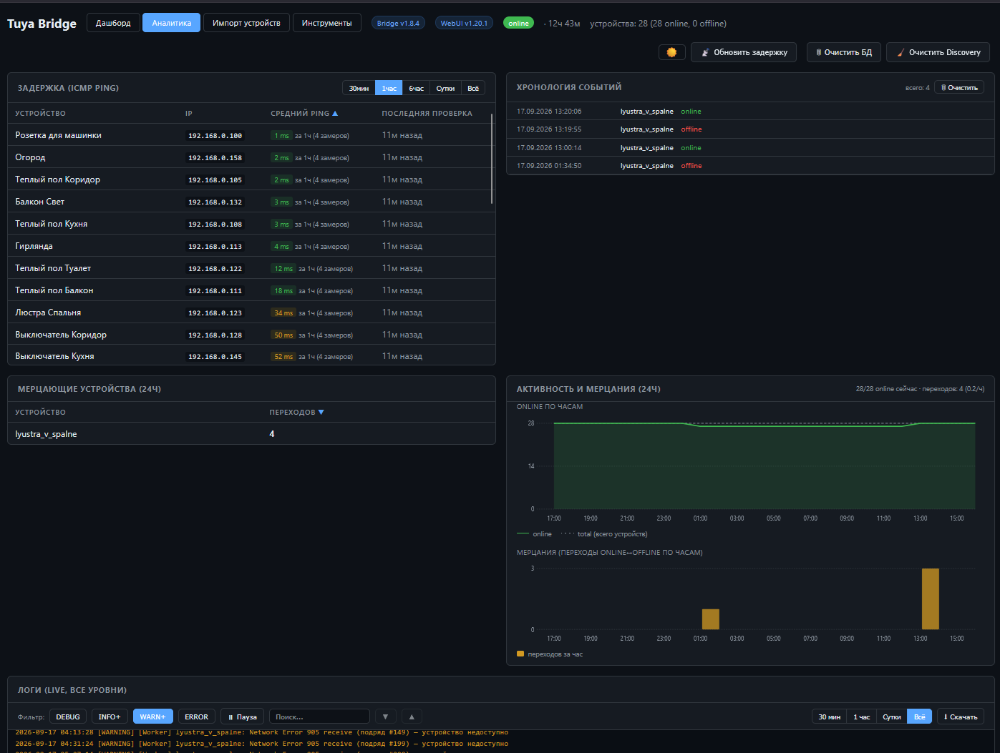
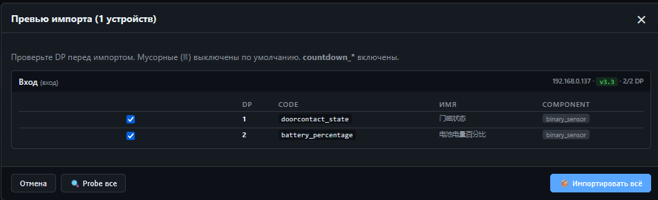

# Tuya WiFi → MQTT Bridge for Home Assistant

Локальный мост Tuya-устройств в Home Assistant через MQTT. Работает **без Tuya Cloud** — всё общение с устройствами идёт по локальной сети через `tinytuya`. Автоматически создаёт сущности в HA через MQTT Discovery.


## История возникновения и предпосылки

Долгое время я использовал свой HA в купе с [tuya-local](https://github.com/make-all/tuya-local), но начиная с версии 2026.3.3 появились постоянные отвалы и залипания устройств, шло время версии менялись, но проблема так и не была решена. Я решил создать свой mqtt мост для управленяи своими устройствами локально и держать все под своим контролем. На данный момент проект полностью стабилен и каких то особых дополнительных фич не планирууется. Единственное что не доделано это управление рулонными шторами и вентиляторами т.к их у меня нет.

Проект был собран специально как монолит по сути в 2 файлах и около 10 000 строк.
Исключительно на русском языке.

## Быстрый старт

### 1. Настройка переменных окружения

**Bridge** (`./bridge/.env`):
```bash
cd ./bridge
cp .env.example .env
nano .env  # отредактируйте MQTT_BROKER и другие настройки
```

**WebUI** (`./webui/.env`):
```bash
cd ./webui
cp .env.example .env
nano .env  # отредактируйте WEBUI_PORT и другие настройки
```

**Docker** (`.env`):
```bash
nano .env  # отредактируйте TZ и если нужно WEB порт
```

### 2. Конфиг устройств

- Используйте WebUI Import после запуска (вкладка `/import`)

или
- Внести данные в `./data/config/devices_config.json`:


  **Где взять `local_key`?**
- [Tuya Cloud](https://iot.tuya.com) → Project → Devices → Local key  

Пример
```json
[
  {
    "id": "YOU_DEVICE_ID",
    "name": "YOU_DEVICE_name_",
    "friendly_name": "YOU_DEVICE_friendly_name_for_Home_Assistant",
    "ip": "192.168.XXX.XXX",
    "local_key": "DEVICE_LOCAL_KEY",
    "version": "3.3",
    "type": "light",
    "model": "HiLightPRO-A",
    "battery_powered": false,
    "enabled": true,
    "dps_map": {
      "20": { "component": "switch", "name": "switch_led" },
      "22": { 
        "component": "number", 
        "name": "bright_value", 
        "min": 10, 
        "max": 1000,
        "unit_of_measurement": "%"
      },
      "23": { 
        "component": "number", 
        "name": "temp_value", 
        "kelvin_min": 2700, 
        "kelvin_max": 6500
      }
    }
  }
]
```

### Climate-специфичные поля

```json
{
  "type": "climate",
  "min_temp": 5,
  "max_temp": 35,
  "temp_step": 1,
  "presets": ["auto", "comfort", "eco"],
  "preset_map": {
    "auto": "Автоматический режим",
    "comfort": "Комфортный режим",
    "eco": "Режим экономии"
  },
  "dps_map": {
    "1":  { "component": "switch", "name": "switch" },
    "16": { "component": "sensor", "name": "temp_set", "scale": 1, "role": "target" },
    "24": { "component": "sensor", "name": "temp_current", "scale": 1, "role": "current" },
    "2":  { "component": "preset", "name": "preset_mode" }
  }
}
```

### Поля верхнего уровня

| Поле | Обязательно | Описание |
|---|---|---|
| `id` | ✅ | Tuya Device ID |
| `name` | ✅ | Уникальное имя (латиница, snake_case) |
| `friendly_name` | ✅ | Человеческое имя для HA |
| `ip` | ✅ | Локальный IP (рекомендуется static/DHCP reservation) |
| `local_key` | ✅ | Локальный ключ Tuya |
| `version` | ✅ | Protocol version: `3.1`, `3.3`, `3.4`, `3.5` |
| `type` | ✅ | `light` / `switch` / `climate` / `sensor` / `binary_sensor` |
| `model` | — | Отображается в HA |
| `battery_powered` | — | `true` для батарейных (обрабатываются иначе) |
| `enabled` | — | `false` чтобы пропустить (default: `true`) |
| `dps_map` | ✅ | Маппинг DP → сущности HA |


### 3. Запуск

```bash
docker compose up -d
```
## Полезные команды

```bash
# Логи
docker compose logs -f tuya-bridge      # Backend
docker compose logs -f tuya-webui       # Frontend

# Управление
docker compose restart                  # Перезапуск
docker compose ps                       # Статус контейнеров
docker compose down                     # Остановить
```

## Доступ к WebUI: `http://localhost:5386`

---







# ЛОНГРИД о проекте


## Возможности

### Устройства

| Тип | Функции |
|---|---|
| **light** | Вкл/выкл, яркость, цветовая температура (kelvin), RGB-цвет |
| **switch** | Одноканальные и многоканальные выключатели, розетки, breaker'ы |
| **climate** | Термостаты: режим, уставка, пресеты (RU/EN) |
| **sensor** | Температура, влажность, энергия, ток, напряжение, мощность |
| **binary_sensor** | Двери, движение, утечка, fault |
| **number** | Числовые настройки (таймеры, лимиты) |
| **phase_a** | Breaker: распаковка DP 6 в напряжение/ток/мощность |
| **select** | Enum-настройки (relay_status) |


### Надёжность

- **Persistent TCP** — одно соединение на устройство (Tuya не держит два → 914)
- **Обработка 904/905/914/900** — 904 как «шум» (3 попытки), 914 — без сброса availability
- **Watchdog** — нет данных > 120 сек → offline
- **Автопереподключение MQTT** — с экспоненциальной задержкой
- **Graceful shutdown** — корректное закрытие сокетов, финальный publish offline
- **Availability per-device** — LWT + `expire_after` в Discovery
- **JSON-кэш** — HA видит последние значения мгновенно после рестарта

### Вкладки

- **Дашборд** — устройства
- **Аналитика** — задержка, хронология, мерцания, активность, **логи**
- **Импорт устройств** — Cloud + скан сети + локальные базы DP
- **Инструменты** — read-only просмотр `devices_config.json`


## Архитектура

```
┌─────────────────────┐         ┌─────────────────────┐
│  tuya-bridge        │         │  tuya-webui         │
│  (main.py)          │         │  (webui.py)         │
│                     │         │                     │
│  Tuya workers ──┐   │         │   ┌──────────────┐  │
│  MQTT client    │   │         │   │ HTTP :5386   │  │
│  STATE_CACHE    │   │         │   │ SQLite       │  │
│                 │   │         │   │ SSE logs     │  │
└─────────────────┼───┘         └──────────┼──────────┘
                  │                        │
                  ▼                        ▼
        ┌──────────────────────────────────┐
        │     MQTT broker (Mosquitto)      │
        └────────────────┬─────────────────┘
                         │
                         ▼
              ┌──────────────────────┐
              │  Home Assistant      │
              │  (MQTT integration)  │
              └──────────────────────┘

Shared volumes:
  config/devices_config.json          — общий (backend: rw, webui: ro)
  logs/bridge.log              — backend пишет, webui читает
  state/state_cache.json       — только backend
  state/              		   — только webui:
    analytics.db
    tinytuya_devices.json
    tuya_cloud_cache.json
    tuya-local-db/
```
---


**Ключевые решения:**

- Backend и WebUI — **отдельные контейнеры**, общаются через MQTT и shared files.
- WebUI **не имеет доступа к Docker socket** и не управляет устройствами.
- Падение WebUI не влияет на мост. Рестарт моста не роняет WebUI.
- **Tuya-устройства не терпят два TCP-соединения** — WebUI использует **только ICMP ping** для latency, без TCP-connect к порту 6668.
- **Cloud-кэш и tuya-local** живут на сервере (`webui_state/`), не в браузере.


## Требования

- **Python 3.10+** (используется `CallbackAPIVersion.VERSION2` в paho-mqtt)
- **tinytuya** ≥ 1.15.0
- **paho-mqtt** ≥ 2.0.0
- **MQTT-брокер** (Mosquitto, EMQX, ...)
- **Home Assistant** с MQTT-интеграцией
- **Docker**  и **Docker Compose**
- **iputils-ping** — для WebUI (ICMP latency)
- **CAP_NET_RAW** — для WebUI-контейнера (для native ICMP ping)

### Home Assistant

HA автоматически подхватит Discovery-топики и создаст все устройства. Проверь:

**Settings → Devices & Services → MQTT** — должны появиться устройства.

---

## Структура файлов окружения

| Файл | Описание | Примеры переменных |
|------|----------|-------------------|
| `bridge/.env` | Переменные для backend'а | MQTT_BROKER, DISCOVERY_PREFIX |
| `webui/.env` | Переменные для frontend'а | WEBUI_PORT, WEBUI_HOST |
| `bridge/.env.example` | Шаблон | - |
| `webui/.env.example` | Шаблон | - |

---

### Настройки в `main.py` (Bridge v1.8.4)

| Параметр | Default | Описание |
|---|---|---|
| `MQTT_BROKER` | `192.168.XXX.XXX` | Адрес брокера |
| `MQTT_PORT` | `1883` | Порт |
| `MQTT_USERNAME` / `MQTT_PASSWORD` | `None` | Креды |
| `TOPIC_PREFIX` | `tuya` | Префикс топиков |
| `POLL_INTERVAL` | `15` | Секунд между активными poll'ами |
| `OFFLINE_TIMEOUT` | `120` | Watchdog: нет данных N сек → offline |
| `AVAILABILITY_EXPIRE` | `120` | HA `expire_after` для сущностей |
| `SOCKET_TIMEOUT_CMD` | `0.3` | Таймаут команды |
| `SOCKET_TIMEOUT_WORKER` | `0.1` | Таймаут receive() в воркере |
| `CMD_POOL_SIZE` | `32` | Потоков для команд |
| `WORKER_IDLE_SLEEP` | `0.4` | Пауза между receive() |
| `LOCK_ACQUIRE_TIMEOUT` | `0.05` | Сколько ждать lock в воркере |
| `MIN_CMD_INTERVAL_STREAM` | `0.15` | Rate limit для light/climate/number |
| `MIN_CMD_INTERVAL_SWITCH` | `0` | Rate limit для switch/select |
| `DEBOUNCE_BY_TYPE` | см. файл | Окна дебаунса по типам DP (мс) |
| `REPEAT_RESET_SECONDS` | `120` | Окно сброса счётчиков 914/905 |
| `CLEANUP_DISCOVERY` | `0` | `1` = очистить Discovery при старте |
| `USE_BATTERY_WORKER` | `False` | Работа с battery_powered устройствами |
| `SCAN_WORKERS` | `32` | Потоков для `_scan_subnet` |
| `SCAN_TIMEOUT` | `0.3` | Таймаут TCP-connect на 6668 |
| `LOG_LEVEL` | `INFO` | DEBUG / INFO / WARNING / ERROR |

### Настройки в `webui.py` (WebUI v1.20.1)

| Параметр | Default | Описание                                                         |
|---|---|------------------------------------------------------------------|
| `WEBUI_PORT` | `5386` | HTTP-порт                                                        |
| `WEBUI_HOST` | `0.0.0.0` | HTTP-хост                                                        |
| `ANALYTICS_ENABLED` | `True` | Полная аналитика                                                 |
| `STATUS_HISTORY_ENABLED` | `True` | Минимальная история в ммодалке устрйоства                        |
| `BRIDGE_STARTUP_GRACE_SEC` | `60` | Игнор online/offline первые N сек после старта bridge (v1.18.9+) |
| `LATENCY_INTERVAL` | `900` | Замер latency (15 минут)                                         |
| `LATENCY_INITIAL_DELAY` | `5` | Первый замер через 5 сек                                         |
| `LATENCY_PING_TIMEOUT` | `1` | Таймаут одной попытки ping (сек)                                 |
| `LATENCY_RETRY_COUNT` | `3` | Кол-во попыток при timeout (v1.18.5+)                            |
| `LATENCY_RETRY_DELAY` | `10` | Пауза между retry (сек)                                          |
| `LATENCY_RETRY_WORKERS` | `10` | Параллельных retry (ThreadPoolExecutor)                          |
| `RETENTION_DAYS` | `3` | Хранение истории в SQLite                                        |
| `SNAPSHOT_INTERVAL` | `60` | Мин. интервал между снапшотами                                   |
| `FLUSH_INTERVAL` | `30` | Запись буфера в SQLite                                           |
| `SSE_MAX_SUBSCRIBERS` | `50` | Лимит SSE-подписчиков                                            |
| `SSE_IDLE_TIMEOUT` | `60` | Таймаут неактивного SSE                                          |
| `EDIT_TIMEOUT_WAIT` | `20` | Таймаут MQTT-ответа edit_config (сек)                            |
| `DELETE_TIMEOUT_WAIT` | `20` | Таймаут delete_device (сек)                                      |
| `IMPORT_TIMEOUT_WAIT` | `30` | Таймаут import_devices (сек)                                     |
| `SCAN_TIMEOUT_WAIT` | `30` | Таймаут scan_network (сек)                                       |
| `SAFE_PORTS` | см. файл | Порты для WebUI-скана                                            |
| `MAC_VENDOR_MAP` | см. файл | Префиксы MAC → вендор                                            |


### DEBUG-флаги (Bridge)

В начале `main.py`:

```python
DEBUG_CACHE_RECEIVE = 0    # логировать data = d.receive()
DEBUG_CACHE_STATUS = 0     # логировать poll_data = d.status()
DEBUG_RAW_DP = 0           # логировать сырые dps
DEBUG_MQTT_CMD = 0         # логировать входящие команды
```

## Возможности фронта

### Аналитика (`/analytics`)

Ряд 1:
- **Задержка (ICMP ping)**:
  * Обновляется раз в 15 минут
  * **Период: `[30мин][1час][6час][Сутки][Всё]`** (по умолчанию 1 час)
  * Средний ping за выбранный период
  * Счётчик замеров динамический (4 / 24 / 96 / ~288)
  * Сортировка таблицы по клику на заголовок (имя / IP / средний / время)
  * Цветовой индикатор: `< 20 мс`, `20-100 мс`, `> 100 мс`, `timeout`
  * Skeleton при первой загрузке
- **Хронология событий**:
  * Все переходы online/offline с timestamp
  * До 500 записей, подпись «показаны последние N из M»
  * Кнопка «🗑 Очистить» — 3 режима: всё / старше N дней-часов / до даты-времени

Ряд 2:
- **Мерцающие устройства (24ч)** — устройства с частыми переходами (≥3 за сутки), сортировка по клику
  * Skeleton при первой загрузке
- **Активность и мерцания (24ч)** — **два графика в одной карточке**:
  * Верхний — online по часам (зелёная линия + заливка, пунктир total)
  * Нижний — bar chart переходов online↔offline по часам (жёлтые столбики)
  * Подписи времени под каждым графиком, легенда вынесена из SVG
  * В шапке: «28/28 online сейчас · переходов: 47 (2.0/ч)»

Ряд 3 (в самом низу):
- **Логи (live)** — SSE-поток, все уровни, фильтры, поиск, пауза, автоскролл (см. ниже)

### Live-логи

- SSE-поток (Server-Sent Events) — реальное время
- Все уровни (DEBUG/INFO/WARNING/ERROR/CRITICAL)
- Кольцевой буфер 5000 строк на сервере
- **Фильтр по уровню** (кнопки DEBUG/INFO/WARNING/ERROR)
- **Фильтр по времени** (30 мин / 1 час / Сутки / Всё)
- **Поиск** с подсветкой, кнопки навигации ▲▼
- **Пауза** / Продолжить
- **Скачать** — видимые строки в файл
- **Автоскролл** по расстоянию от низа, кнопка «↓ Вниз» при скролле вверх


### История

SQLite-хранилище `webui_state/analytics.db`:

| Флаг | Таблицы |
|---|---|
| `ANALYTICS_ENABLED=True` | `status_events`, `latency_history`, `state_history`, `hourly_online_count` |
| `ANALYTICS_ENABLED=False` + `STATUS_HISTORY_ENABLED=True` | `status_events`, `latency_history` |
| Оба `False` | SQLite не создаётся |

**Дополнительно:**
- **`db_query_flaps_hourly()`** — переходы по часам (для bar chart)
- **`db_query_avg_latency(dev, period_seconds)`** — средний ping за секунды (0 = всё время)
- **`db_query_timeline_total()`** — общий счётчик событий
- Retention 3 дня
- Snapshots пишутся только при изменении, не чаще 1/мин
- Flush буфера раз в 30 сек

### Импорт устройств (`/import`)

- Ввод Access ID / Access Secret / Region (Tuya Cloud)
- **Креды сохраняются в `localStorage`** браузера
- **Cloud-кэш на сервере** — `webui_state/tuya_cloud_cache.json` (chmod 600), переживает пересоздание контейнера
- **Баннер о старом кэше** — если >6ч, показывается сверху с кнопками «Запросить из облака» / «Скрыть»
  * Цветной индикатор возраста в `#cloud-cache-info`: серый / жёлтый ⚠️ / жёлтый 🔴 / красный 🔴 устарел
- **Кнопка «🗑 Очистить»** — рядом с «Запросить устройства»
- **Fetch devices** — прямое обращение к Tuya API (в 2 запроса: `getdevices(True)` + `getdevices(False, include_map=True)`)
- **Поиск** над Cloud-таблицей — имя / ID / продукт / тип, debounce 150 мс
- **on/off** в колонке Online (зелёный / серый)
- **Цветные плашки** типов устройств
- Автогенерация `dps_map` из Tuya mapping + tuya-local YAML (по `product_id`)
- Автоопределение типа по category
- Выборочный импорт: чекбоксы + IP + friendly_name
- **Модалка превью** перед импортом:
  * На ПК — все устройства сразу, DP-табличка с чекбоксами
  * На мобиле — пошагово (по одному устройству)
  * Мусорные DP (JUNK_DP_CODES) выключены по умолчанию
  * **Version badge** для протокола в шапке карточки
  * Кнопка «🔍 Probe все» — probe + сопоставление DP↔code по значению и типу
  * **`getDeviceMapping(d)`** — фолбэки `d.mapping → d._raw_cloud.mapping → d.dps_map_generated` (v1.18.10)
  * **Статус probe** в шапке карточки (`.preview-probe-status`), не пропадает после перерисовки (v1.18.14)
  * **Таймаут probe 15 сек** через `AbortController` (v1.18.11)
- Импорт отправляется в backend через MQTT

### Network scan

- **WebUI-скан:** ICMP ping + ARP + MAC vendor + safe ports. Tuya-проба (6668 + UDP 6666/6667) **только для неизвестных IP**. Сортировка по IP.
- **Bridge-скан:** bridge 1.8.4 сам сканирует подсеть через TCP 6668 и **обогащает hosts**:
  * `known: true` — IP уже в `devices_config.json` (probe не делается)
  * `tuya: {port_6668: true, udp_port: 6666|6667, gwId, productKey, version}` — если UDP-проба успешна (точно Tuya)
  * `tuya: {port_6668: true, tuya_probable: true}` — TCP открыт, UDP молчит (вероятно Tuya, но не факт)
  * `tuya_unknown: true` — для неизвестных IP с Tuya-признаками
  WebUI использует эти поля **как есть** (не выдумывает на клиенте). Бейджи:
  * `✅ Bridge: UDP 6666 подтверждён` + `Tuya (UDP подтверждён)`
  * `📡 Bridge: 6668 открыт` + `Tuya? (TCP 6668)`
  * `📡 из Bridge`
  * **Version badge** для `h.tuya.version`

### Локальные базы DP

На странице `/import` блок «Локальные базы DP»:
- **`tinytuya_devices.json`** — `webui_state/tinytuya_devices.json`, содержит mapping от Cloud
- **tuya-local база** — `webui_state/tuya-local-db/`, 1700+ YAML-шаблонов
- Кнопки:
  * **🔄 Обновить** — обновить инфо о базах
  * **⬇ Обновить tuya-local** — скачать/перекачать из GitHub (tarball)
  * **🔄 Пересобрать tinytuya.json** — фоновый probe каждого устройства + merge mapping (с прогресс-баром)

**Автомиграция:** старая `/app/tuya-local-db` (из 1.18.0) → `webui_state/tuya-local-db` при первом старте.

### Инструменты (`/tools`)

- **Read-only** просмотр `devices_config.json`
- **Raw JSON** — полный файл с подсветкой синтаксиса (**своя**, без CDN)
- **По устройствам** — список слева, детали справа
- Кнопки: **Обновить**, **Копировать JSON**
- При ошибке: «Конфиг недоступен» + кнопка «Повторить»

### Тема

- Переключатель ☀️/🌙 в шапке
- Тёмная по умолчанию (GitHub Dark)
- Светлая — GitHub Light
- Выбор сохраняется в `localStorage`

## Топики MQTT

### Команды (HA → мост)

| Топик | Payload | Пример |
|---|---|---|
| `tuya/light/<dev>/set` | JSON | `{"state":"ON","brightness":180,"color_temp_kelvin":4000}` |
| `tuya/switch/<dev>/<entity>/set` | `ON` / `OFF` | `ON` |
| `tuya/climate/<dev>/mode/set` | `off` / `heat` | `heat` |
| `tuya/climate/<dev>/temp/set` | Число (°C) | `22.5` |
| `tuya/climate/<dev>/preset/set` | Название пресета | `Комфортный режим` |
| `tuya/select/<dev>/<entity>/set` | Из options | `on` |
| `tuya/number/<dev>/<entity>/set` | Число | `45` |
| `tuya/bridge/cleanup` | `1` | — |
| `tuya/bridge/edit_config` | JSON | `{device, changes, validate, request_id}` |
| `tuya/bridge/delete_device` | JSON | `{device, request_id}` |
| `tuya/bridge/import_devices` | JSON | `{devices, overwrite, request_id}` |
| `tuya/bridge/scan_network` | JSON | `{subnet, request_id}` |

### Состояние (мост → HA)

| Топик | Payload |
|---|---|
| `tuya/light/<dev>/state` | JSON: `{state, brightness, color_mode, color, color_temp_kelvin}` |
| `tuya/switch/<dev>/<entity>/state` | `ON` / `OFF` |
| `tuya/climate/<dev>/mode/state` | `off` / `heat` |
| `tuya/climate/<dev>/temp/state` | Число |
| `tuya/climate/<dev>/current/state` | Число |
| `tuya/climate/<dev>/preset/state` | Название |
| `tuya/select/<dev>/<entity>/state` | Значение |
| `tuya/number/<dev>/<entity>/state` | Число |
| `tuya/<dev>/dps/<dp>/state` | Значение сенсора (с учётом `scale`) |
| `tuya/<dev>/phase_a/voltage/state` | Вольты |
| `tuya/<dev>/phase_a/current/state` | Амперы |
| `tuya/<dev>/phase_a/power/state` | Киловатты |

### Диагностика

| Топик | Payload | Обновление |
|---|---|---|
| `tuya/bridge/status` | `online` / `offline` (LWT) | При старте / падении |
| `tuya/bridge/uptime` | Секунды | Раз в 30 сек |
| `tuya/bridge/version` | Версия Bridge | При старте |
| `tuya/<dev>/status` | `online` / `offline` | При изменении |
| `tuya/<dev>/last_seen` | Unix-timestamp | При каждом успешном ответе |
| `tuya/<dev>/cache_snapshot` | JSON всех DP | При каждом успешном опросе |

### Результаты команд (мост → WebUI)

Все `*_result` топики содержат `request_id` — он передаётся обратно даже в ошибочных ветках (`config edit disabled`, `invalid json`, `read config failed`).

| Топик | Payload |
|---|---|
| `tuya/bridge/edit_config_result` | `{request_id, device, ok, error, changes, ts}` |
| `tuya/bridge/delete_device_result` | `{request_id, ok, error, device, ts}` |
| `tuya/bridge/import_devices_result` | `{request_id, ok, added, updated, skipped, errors, ts}` |
| `tuya/bridge/scan_network_result` | `{request_id, ok, hosts, subnet, ts}` |


### API

| Метод | Путь | Описание |
|---|---|---|
| GET | `/` | HTML dashboard |
| GET | `/analytics` | HTML analytics |
| GET | `/import` | HTML import |
| GET | `/tools` | HTML tools |
| GET | `/healthz` | Healthcheck (200/503) |
| GET | `/api/status` | JSON: bridge + devices |
| GET | `/api/config/raw` | JSON: полный `devices_config.json` |
| GET | `/api/device/<name>/secret` | Local key устройства |
| GET | `/api/device/<name>/history` | История статусов |
| GET | `/api/device/<name>/latency` | История latency |
| GET | `/api/device/<name>/avg_latency?latency_seconds=N` | Средний ping (0 = всё) |
| GET | `/api/analytics?latency_seconds=N` | Аналитика (`0` = всё время) |
| GET | `/api/base/info` | Инфо о локальных базах DP |
| GET | `/api/base/rebuild/progress` | Прогресс пересборки tinytuya.json |
| GET | `/api/latency/refresh/progress` | Прогресс ручного ping |
| GET | `/api/cloud/cache` | Cloud-кэш (на сервере) |
| GET | `/api/logs/history?tail=1000` | Последние N строк логов |
| GET | `/api/logs/stream?since=0` | SSE-поток логов |
| POST | `/api/cleanup` | Опубликовать команду cleanup |
| POST | `/api/latency/refresh` | Ручной замер задержки |
| POST | `/api/db/cleanup` | Очистка SQLite (scope: all / timeline / timeline_age / timeline_before) |
| POST | `/api/device/<name>/config` | Edit device |
| POST | `/api/device/<name>/delete` | Delete device |
| POST | `/api/scan/extended` | WebUI-скан (ICMP + ARP + probe) |
| POST | `/api/scan/bridge` | Bridge-скан через MQTT |
| POST | `/api/cloud/fetch` | Fetch Tuya Cloud |
| POST | `/api/cloud/probe_and_match` | Probe + сопоставление DP |
| POST | `/api/cloud/cache` | Сохранить/очистить Cloud-кэш |
| POST | `/api/base/tuya-local/update` | Скачать/обновить tuya-local |
| POST | `/api/base/tinytuya/rebuild` | Пересобрать tinytuya.json |
| POST | `/api/import_devices` | Import devices |

# Известные проблемы и их решения

### Ошибка `914: Check device key or version`

Tuya отвечает `914` в трёх случаях:

1. **Неверный `local_key`** — реальная проблема конфига.
2. **Неверный `version`** (`3.1` vs `3.3` vs `3.4`) — реальная проблема.
3. **Cold start** после перезагрузки устройства — Tuya «прогревается» 15-30 минут.

**Smart logging** в Bridge 1.8.4 — первый 914 = INFO, повтор — WARNING с backoff (раз в 100 событий).

**Важно (WebUI 1.18.3+):** кнопка «Сохранить» в edit-модалке больше **не вызывает 914**, потому что WebUI шлёт `validate: False`. Раньше — да, вызывала (bridge сам пробовал probe при edit, а устройство уже занято bridge'ом → 914).

### Устройство висит online после отключения питания

Tuya-модули имеют конденсатор, который держит Wi-Fi **2-5 минут** после отключения. Это нормально. Watchdog сработает после `OFFLINE_TIMEOUT` (120 сек).


### Ошибка `905: Network Error: Device Unreachable`

`905` — код `tinytuya` для сетевой ошибки.

- **Единичный `905`** — нормальное поведение. Bridge логирует, ждёт `OFFLINE_TIMEOUT`, переводит в `offline`.
- **Массовый `905`** — сетевое событие (перезагрузка роутера). Bridge **правильно реагирует** — 905 → `drop_device_conn` → сокет закрывается → следующее соединение создаётся заново.

### Устройства «мерцают» в аналитике

- **Нормальное поведение** для Tuya. Смотри `Мерцающие устройства` — 20-30 переходов за 24ч это обычная работа (перезапуски соединений, физические отключения).
- Если переходов > 100 за сутки — смотри логи bridge: `docker logs tuya-bridge 2>&1 | grep -E "restart|914|905"`.
- **Важно:** WebUI **не влияет** на мерцание. Bridge сам решает, когда переподключаться.
- **v1.18.9:** введён grace period `BRIDGE_STARTUP_GRACE_SEC = 60` — после старта bridge события online/offline не пишутся в БД, чтобы рестарт bridge не выглядел «фантомным мерцанием».

## Известные особенности

### Tuya 904 «Unexpected Payload»

Нормальное поведение persistent-сокета. Мост делает 3 попытки reconnect, только после этого переводит устройство в offline.

### Задержка offline

15-120 секунд от потери питания до `offline` в HA. Обусловлено конденсатором Wi-Fi-модуля и `POLL_INTERVAL = 15`.

### `color_temp` + `brightness` в HA

HA не любит, когда в `color_mode: color_temp` публикуется `brightness != 255`. Мост не публикует `brightness` в этом режиме.

### Battery-powered устройства

Требуют `USE_BATTERY_WORKER = True`. Опрос реже (раз в 5 минут), чтобы не сажать батарею.
Но они все равно работают не очень, хотя и поддерживаются.

### DHCP

Обязательно нужно использовать  **DHCP reservation** для всех Tuya-устройств по MAC-адресу на роутере.


### Два TCP-соединения к Tuya — не работают

**Tuya-прошивки не терпят два TCP-соединения к одному устройству с одного IP.** Второе соединение воспринимается как «чужой» клиент, Tuya сбрасывает оба и отвечает `914`.

**Правило:** любое **внешнее TCP-подключение** к Tuya-устройству на порт 6668, **пока Bridge держит persistent-сокет**, воспринимается устройством как «чужой» клиент.

**Следствия:**

- ❌ Нельзя делать `latency_worker` через TCP-connect
- ❌ Нельзя запускать `tinytuya scan` на том же порту, пока Bridge работает.
- ❌ Нельзя запускать второй Bridge на те же устройства.
- ❌ Нельзя делать TCP-probe (`/api/cloud/probe_and_match`) на устройство, которое **уже** в конфиге bridge и держит соединение.
  * **Проверка:** WebUI сверяет IP с `get_known_ips()` и пропускает известные (возвращает `IP already in config`).
- ✅ **ICMP ping** — безопасен, не трогает порт 6668.
- ✅ **UDP-проба 6666/6667** (используется в bridge-скане 1.8.4) — безопасна, не конфликтует с persistent-сокетом, Tuya отвечает на неё даже когда TCP занят.
- ✅ Один persistent сокет на устройство — единственный правильный вариант.

### Bridge-скан: безопасность UDP-пробы

Начиная с 1.8.4, bridge при `scan_network` делает:

1. TCP connect на 6668 (как и раньше) — определяет, что порт открыт.
2. **Для неизвестных IP** — UDP-пробу 6666/6667 (payload `0x000055aa...`).
3. UDP-проба **не мешает** persistent-сокету bridge: это отдельный UDP-канал, Tuya отвечает на него даже когда TCP занят.

Раньше (1.8.3 и ниже) bridge отдавал только `{ip, ms}`, а WebUI **выдумывал** `tuya: {port_6668: true, tuya_probable: true}` для всех новых IP. Теперь всё — из bridge.

### Cloud-кэш и tuya-local 

**Автомиграция** старой `/app/tuya-local-db` → `webui_state/tuya-local-db` при первом старте.

**Требование:** `webui_state/` должна быть **bind-mount** в volume контейнера.

### Firmware Tuya

Tuya может обновить прошивку и сменить DP-раскладку. Диагностика: `DEBUG_RAW_DP = 1`.

### Firmware-баг broadcast на v3.4+

Некоторые Tuya-устройства на protocol 3.4+ крашатся от broadcast/multicast-пакетов. Лечится блокировкой broadcast/multicast на IoT-VLAN.

---

## Производительность (эталон)

Пример моей конфигурации: **40 Tuya-устройств**

| Метрика | Значение                               |
|---|----------------------------------------|
| Bridge CPU (покой) | ~5%                                    |
| Bridge RAM | ~35 МБ                                 |
| WebUI CPU (покой) | < 1%                                   |
| WebUI RAM | ~35 МБ                                 |
| Задержка HA → Tuya | **< 400 мс**                           |
| Tuya → HA (физическое изменение) | **≤ 15 с**                             |
| HA → HA (после команды) | **< 500 мс**                           |
| TCP-connect WebUI → Tuya | **0** (ICMP-only)                      |
| Reconnect'ов / час на 40 устройств | < 0                                    |
| Ошибки `914` | Единичные                              |
| Первый запуск | **0 сетевых запросов в открытую сеть** |

---

## Версии

- **Bridge**: v1.8.4
- **WebUI**: v1.20.1

# Благодарности

1. Проекту [tinytuya](https://github.com/jasonacox/tinytuya)
3. Проекту [paho.mqtt.python](https://github.com/eclipse-paho/paho.mqtt.python)
4. Проекту [tuya-local](https://github.com/make-all/tuya-local)

Проект был собран с использованием ИИ
